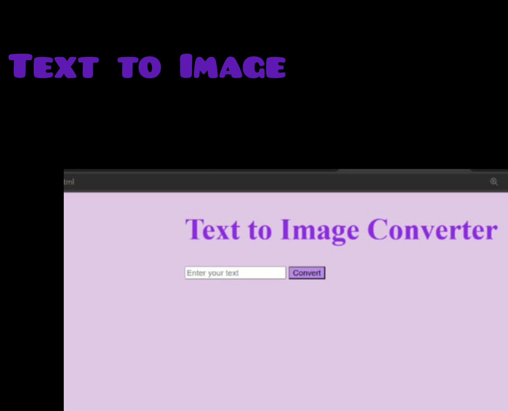

# My Portfolio

Welcome to my portfolio! This project showcases my skills, projects, and experience as a web developer. It is designed to provide potential employers and collaborators with an overview of my work and capabilities.

## Table of Contents

- [Introduction](#introduction)
- [About Me](#about-me)
- [Skills](#skills)
- [Projects](#projects)
- [Resume](#resume)
- [Contact](#contact)
- [Installation](#installation)
- [Usage](#usage)
- [Contributing](#contributing)
- [License](#license)

## Introduction

This is a personal portfolio website for showcasing my work as a web developer. It includes information about me, my skills, my projects, and ways to contact me.

## About Me

I am Madhuri Ediga, a passionate web developer with experience in HTML, CSS, JavaScript, and more. I love creating beautiful and functional websites that provide great user experiences.


## Skills

- HTML
- CSS
- JavaScript
- Responsive Design
- UI/UX Design
- Basic AI

## Projects

### Project 1



"A dynamic web application leveraging HTML, CSS, and JavaScript to convert user-inputted text into visually appealing images through an API integration, offering a seamless way to generate custom graphics."

### Project 2


"A simple Python script featuring a chatbot interface that assists users in ordering customized burgers, validating inputs for burger type, toppings, delivery address, and phone number."

## Resume

You can download my resume [here](resume.pdf).

## Contact

- Email: madhuriediga8@gmail.com
- Phone: 814-326-5327
- GitHub: [Madhuri50](https://github.com/Madhuri50)
- LinkedIn: [Madhuri Ediga](https://www.linkedin.com/in/madhuriediga)

## Installation

To run this project locally, follow these steps:

1. Clone the repository:
    ```bash
    git clone https://github.com/Madhuri50/portfolio.git
    ```
2. Navigate to the project directory:
    ```bash
    cd portfolio
    ```
3. Open `index.html` in your browser to view the portfolio.

## Usage

This website is designed to be a static portfolio site. Simply open `index.html` in a web browser to view the content. Ensure all the assets (images, CSS files) are in the correct directories as referenced in the HTML file.

## Contributing

Contributions are welcome! If you have any suggestions or improvements, please feel free to open an issue or submit a pull request.

## License

This project is licensed under the MIT License. See the [LICENSE](LICENSE) file for details.
